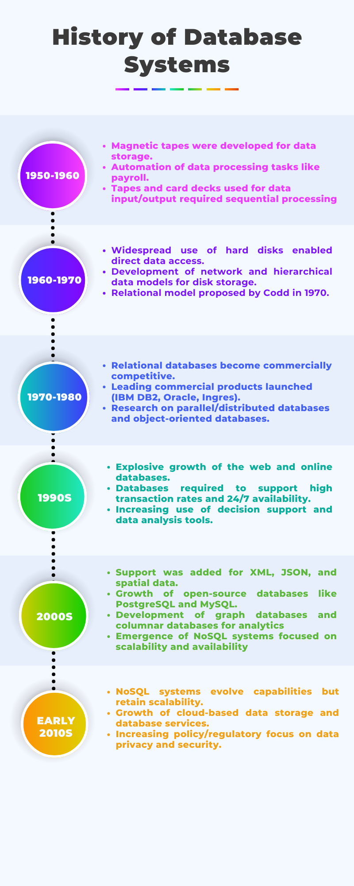
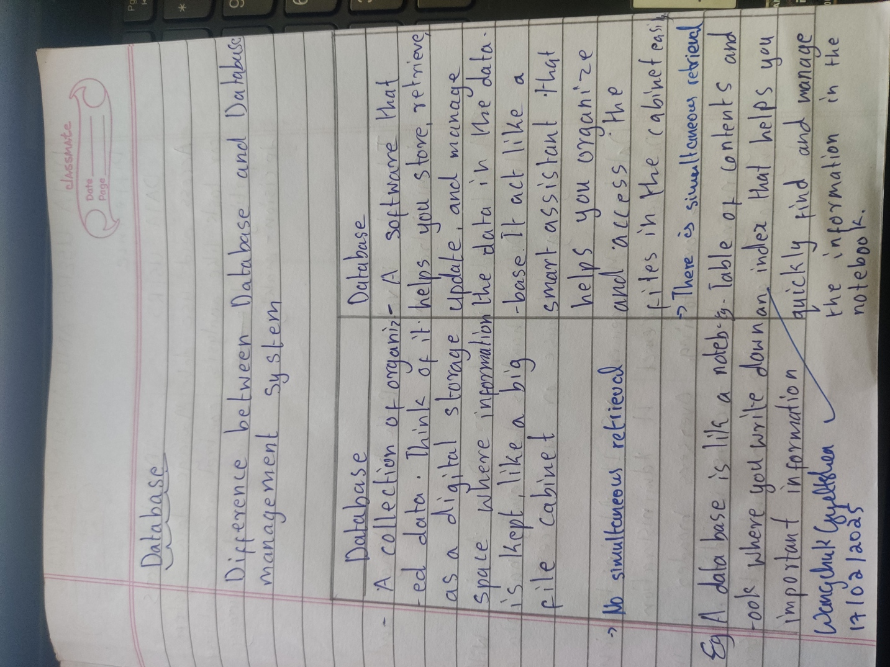

<!-- Main -->

<!-- One -->
<section id="one">
	

		<header class="major">
			<h1>Unit 1</h1>
		</header>

<!-- Content -->
<h2 id="content">Entering uncharted territory... aka, I have no clue what I'm doing!😵‍💫</h2>

I know this software is new, but as soon as I heard about this new module 🫨, I was like, 'What the hell is that?' I only knew that a database is a collection of data. With the little knowledge I had about this module, I thought it would be tough and that I had just wasted my father's money 🥲. But after the first class, I realized, 'This isn't that bad or hard!'

All thanks to Miss Palden Wangmo Dorji (my lecturer), who has a great way of teaching—I’m able to understand it easily!

Wanna know what I’ve learned so far? 🤔

 
<h4 id="Content">Key Takeaways from the Unit</h4>

Databases Are Superheroes – They save us from messy files, lost papers, and chaotic spreadsheets. Instead of storing data in random places, a database organizes everything neatly.

File-Processing Systems Are Like Old, Slow Turtles 🐢 They have redundancy issues, security problems, and make finding data a nightmare where a database system is like an upgraded rocket ship🚀 – fast, secure, and efficient.

 Databases started simple but evolved into powerful tools that handle massive amounts of data with ease.

 
<h5 id="Content">H/W</h5>

Sorry for the Handwriting🥲 but i swear my answer are correct ! 😅(Thank you ChatGPT)

  

There are many different data models and they can be classified into 4 categories(1. Entity-Relationship Model
2. Semi-structured Data Model
3. Object Based Data Models
4. Relational Model) among them i prefer Entity-Relationship Model because i had spent 2hr to do creat a Entity -Relationship Model for my assignment.

This is my ER model for my assignment, it took me 2hr to create this model and i am very proud of myself.🤣

But the other 3 models 🥲 i didn't understand because i was dreaming about my favorite food 🍔🍟🥤 while my lecturer was explaining it.(Sorry miss😓)

<h4 id="Content">Why This Matter</h4>

 Efficiency = More Free Time – A good database system saves time. More time = more naps. That’s reason enough to care! 😴

Security Matters – Imagine if your embarrassing search history was stored in an unprotected Excel file. Exactly. A database system keeps important information safe from prying eyes! 🔐

The relational model, SQL, and different data models help in designing well-structured databases.🫨
 

<h4 id="Content">Personal Growth and Reflection</h4>

Before: "Databases sound boring."
After: "Whoa, databases run EVERYTHING?!?"

I now see databases in everyday life—Netflix recommendations, my bank app and etc(End of thinking capacity😊)

I don’t understand EVERYTHING, but at least I know the important stuff!🤣(Thank you so much miss, hope you keep the same energy in the next classes)

