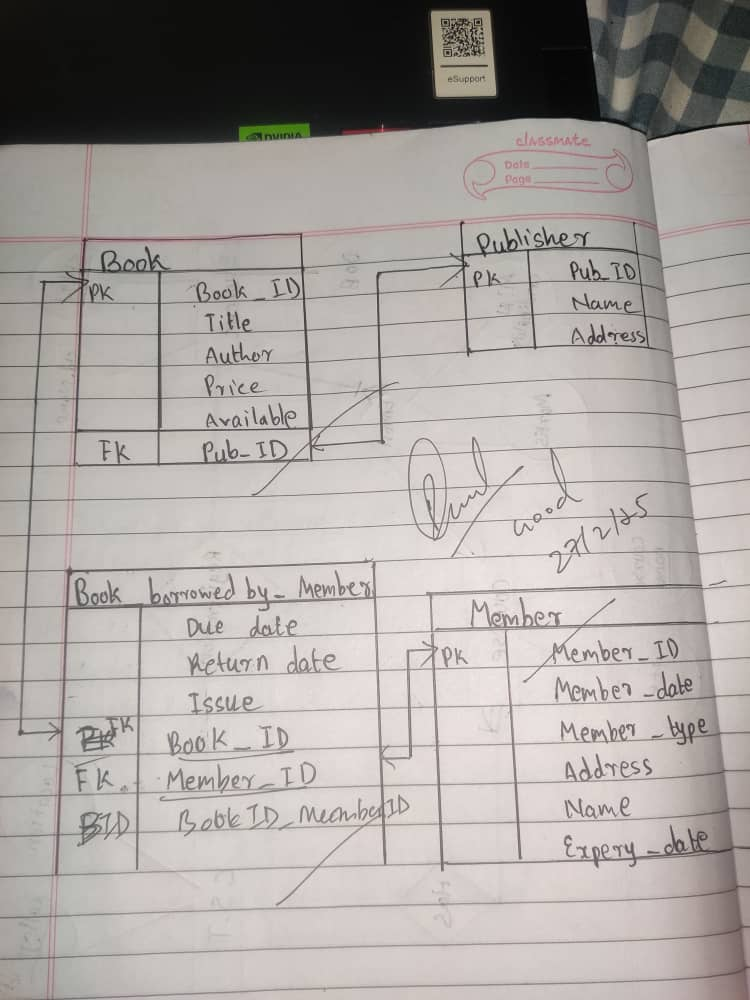

<!-- Main -->

<!-- One -->
<section id="one">
	

		<header class="major">
			<h1>Unit 3</h1>
		</header>

<!-- Content -->
<h2 id="content">Databases: Where ACID 🧪 Isn’t Just About Chemistry 😁</h2>

Ever wondered what keeps your database from turning into a chaotic mess? Meet ACID properties—no, not the kind that melts your desk 🤧, but the ones that keep your transactions safe and sound. Let’s break it down before your brain crashes like a badly handled transaction.🫨

 
<h4 id="Content"> ACID: The Four Horsemen of Database Integrity</h4>

1. Atomicity – All or Nothing! 🤝
A transaction is like ordering a pizza🍕. If the delivery guy forgets the toppings (or worse, the pizza), you reject the whole thing. In databases, if one part of a transaction fails, nothing gets saved. No half-baked pizzas here.🤧

2. Consistency – Keeping Things Real🫨
Ever played Jenga? Imagine if after every turn, the game magically repaired itself to avoid collapse. That’s consistency. No matter what happens, the database stays in a valid state—no floating records or random data ghosts.🤯

3. Isolation – Stay in Your Lane 🧐
Multiple transactions working together can be a nightmare. It’s like two people trying to edit the same Google Doc at once—someone’s changes might get overwritten. Isolation makes sure each transaction happens independently, no unwanted collisions.🐼

4. Durability – No Takebacks! 😀
Once a transaction is committed, it’s permanent. Think of it like posting an embarrassing tweet—no power outage or system crash can take it back.😨

 
<h4 id="Content"> SQL: The Language of Databases (and Frustration)</h4>

SQL (Structured Query Language) is the magic spell you chant to communicate with databases. It comes in different flavors:

DDL (Data Definition Language) – Creates and structures your tables (like the architect).

DML (Data Manipulation Language) – Edits, deletes, and adds data (like the handyman).

Constraints – The rules that keep your data from turning into nonsense (like a strict teacher).

  

<h4 id="Content">🎭 SQL Constraints: Because Rules Matter</h4>

Databases have rules, just like real life. Here are a few that keep your data from going wild:

NOT NULL – No empty seats at the table. Every column needs data!

UNIQUE – No clones allowed! Every entry must be different.

PRIMARY KEY – The one unique ID that makes each row special (like your CID number).

FOREIGN KEY – Connecting tables like social networks (but with fewer cat videos).

CHECK – “Are you sure?” This ensures valid data (e.g., age can’t be -5).

<h4 id="Content">FACTS</h4>

Database Schema: The logical design of the database (the architect's plan).

Database Instance: A snapshot of the database at a given time (like a messy dorm room before cleaning day).

<h4 id="Content">So, we are given a taask to make ER Module to a Relational Scheme </h4>

Here is my ER model and I have converted it to relational scheme in a perfect way 😎😎 litterly this is the hardest ER module where other got simple ER model 🤣(i'm the only one with hardest question)
b
 

<h2 id="Content">Relational Algebra: The Secret Code of Databases!🤫</h2>

Imagine you’re at a restaurant. You ask the waiter for all pizzas on the menu, but only the ones with extra cheese. That’s basically what relational algebra does—it’s the secret language databases use to filter, combine, and organize data! Let’s break it down in the most entertaining way possible.

<h4 id="Content">What is Relational Algebra?</h4>

It’s a functional query language that helps databases understand what information you want. Think of it like a menu of commands you give to get specific data.

<h3 id="content">The Main Operations (a.k.a. Superpowers!)<h3>
<h4 id="Content">1. Selection (σ) – The picky eater 🍕</h4>

This operation picks only the rows (tuples) that meet a certain condition.
📌 Example: "Give me all students whose ID is 12345."
💻 Code: σstudentNo=12345(Student)
(Sounds fancy, but it’s just SQL's SELECT * FROM Student WHERE StudentNo = 12345)

<h4 id="Content">2. Projection (π) – The minimalist 🎭</h4>

It chooses only specific columns (attributes), ignoring the rest.
📌 Example: "I just need names and IDs, no addresses!"
💻 Code: πName, StudentNo(Student)
(Like SQL’s SELECT Name, StudentNo FROM Student)

<h4 id="Content">3. Union (∪) – The friendly merger 🤝</h4>

It combines two tables by stacking all unique rows together.
📌 Example: "Show me all students from Class A and Class B."
💻 Code: ClassA ∪ ClassB
(Same as SQL’s SELECT * FROM ClassA UNION SELECT * FROM ClassB)

<h4 id="Content">4. Intersection (∩) – The common ground ✋</h4>

Finds the rows that appear in both tables.
📌 Example: "Show me students who are in both Football and Basketball teams."
💻 Code: Football ∩ Basketball
(Like SQL’s SELECT * FROM Football INTERSECT SELECT * FROM Basketball)

<h4 id="Content">5. Difference (-) – The eliminator 🚫</h4>

Finds rows that exist in one table but not in another.
📌 Example: "Show me students who are in Football but not in Basketball."
💻 Code: Football - Basketball
(Like SQL’s SELECT * FROM Football EXCEPT SELECT * FROM Basketball)

<h4 id="Content">6. Cartesian Product (×) – The chaotic mixer 🎲</h4>

It combines every row from one table with every row from another. (Warning: Can get messy fast!)
📌 Example: "Match all students with all courses."
💻 Code: Students × Courses
(Like SQL’s SELECT * FROM Students CROSS JOIN Courses)

<h4 id="Content">7. Join (⋈) – The power couple 💑</h4>

It combines two tables based on a common column.
📌 Example: "Match students to their departments."
💻 Code: Students ⋈ DeptID=Dept.ID Departments
(Like SQL’s SELECT * FROM Students JOIN Departments ON Students.DeptID = Departments.ID)

<h3>Writing SQL Queries Like a Pro (Or at Least Not Like a Noob)😎</h3>

1. Selecting All Entries (Because We’re Nosy!)🫨

SELECT * FROM Users;

2. Selecting Specific Columns (For When You’re Picky)🤧

SELECT Username, F_Name, L_Name FROM Users WHERE Gender = 'Male';

3. Filtering Data Like a Pro😁

SELECT * FROM Users WHERE Gender = 'Male' AND DOB > '1990-01-01';

4. Ordering Data (Because We Love Organization!)🙂

SELECT * FROM Users ORDER BY L_Name DESC;

<h3>Aggregate Functions: Ignoring NULL Like an Ex😏</h3>

When SQL performs aggregate functions like SUM() or AVG(), it straight-up ignores NULL values. Imagine counting the number of people in a room but ignoring anyone who’s standing in a corner. That’s SQL for you.

<h3>The Group By Clause: SQL’s Way of Sorting the Party😁</h3>

Ever been at a party where people naturally group themselves? The tech nerds, the food lovers, the ones glued to their phones? That’s what the GROUP BY clause does—it neatly sorts data into groups, making it easier to analyze.

<h3>The HAVING Clause: Like a Bouncer at the Club🔐</h3>

The HAVING clause filters groups the way a bouncer filters people at a nightclub. If you don’t meet the conditions (e.g., average salary > $42,000), you’re not getting in. Sorry, SQL has standards.

<h3>Subqueries: SQL’s Inception Moment😀</h3>

A subquery is a query inside a query. It’s like ordering a burger and getting a surprise mini burger inside. Subqueries help SQL find answers in layers, making sure your data is exactly what you need (or more complicated than necessary).

<h3>Modifying Databases: The Power Moves</h3>

DELETE: Like throwing out old clothes you no longer need.🤧

INSERT: Like adding new clothes to your wardrobe.🧐

UPDATE: Like giving your favorite t-shirt a fresh coat of fabric paint.🖌️

<h3>Window Functions: SQL’s CCTV👀</h3>

Window functions let you analyze data while still keeping all rows visible—kind of like having CCTV footage of every transaction. Unlike regular aggregate functions, they don’t lump data together but allow you to peek at trends over a dataset.

<h4 id="Content">Why This Matter</h4>

Understanding SQL isn't just about writing queries; it’s about thinking logically🤔, solving problems🤯, and handling complexity like a pro😎. In the real world, everything is about data—from your Netflix recommendations to your bank transactions. Mastering SQL gives you a superpower🦸: the ability to make sense of the digital world around you.🕷️

Plus, let’s be honest, being able to troubleshoot a database issue makes you look like a wizard to non-tech folks🧙‍♂️. And who wouldn’t want that? 
 

<h4 id="Content">Personal Growth and Reflection</h4>

Thanks to Miss! 😀 With the help of this unit, I can now use PostgreSQL like a pro (thanks to Miss’s notes and ChatGPT 😉). Not only that, but I also know how to create ER diagrams, convert them into schemas, and write SQL queries with ease. 😊
 

